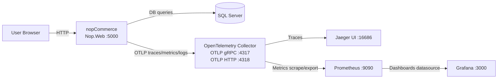

# Assignment 1 - nopCommerce + OpenTelemetry

Este README resume os passos para ligar os serviços do projeto:

- Observabilidade: OpenTelemetry Collector, Jaeger, Prometheus e Grafana
- Aplicação: nopCommerce + base de dados (SQL Server)

## Pré-requisitos

- Docker Desktop em execução
- .NET 8 ou 9 SDK instalado

**Nota:**  
Se a aplicação falhar ao iniciar ou o build der erro de ficheiros bloqueados, executar:

```powershell
Get-Process -Name "Nop.Web", "dotnet" -ErrorAction SilentlyContinue | Stop-Process -Force
dotnet clean nopCommerce/src/NopCommerce.sln
```

---

## 1. Ligar a stack de observabilidade

Executar na raiz do workspace (nopCommerce):

```powershell
Get-ChildItem -Path . -Include bin,obj -Recurse | Remove-Item -Recurse -Force
docker compose -f observability/docker-compose.yml up -d
docker compose -f observability/docker-compose.yml ps
```

### Endpoints úteis

- Jaeger UI: http://localhost:16686  
- Prometheus: http://localhost:9090  
- Grafana: http://localhost:3000  

### OTLP Collector

- gRPC: `localhost:4317`  
- HTTP: `localhost:4318`

---

## 2. Ligar o nopCommerce

### SQL Server

Certificar que o contentor da base de dados está a correr:

```powershell
docker start sqlserver
docker ps --format "table {{.Names}}\t{{.Status}}\t{{.Ports}}"
```

### Compilar e correr a aplicação

```powershell
cd .\nopCommerce\src
dotnet run --project Presentation\Nop.Web\Nop.Web.csproj
```

Depois de arrancar, abrir:

- nopCommerce: http://localhost:5000

---

## 3. Verificar serviços e logs

Para verificar se os serviços de observabilidade estão saudáveis:

```powershell
docker compose -f observability/docker-compose.yml ps
```

Para logs do coletor em tempo real (útil para ver se os dados estão a chegar):

```powershell
docker compose -f observability/docker-compose.yml logs -f otel-collector
```

---

## 4. Desligar os serviços

Usa o mesmo ficheiro compose com que iniciaste a stack:

```powershell
docker compose -f observability/docker-compose.yml down
docker stop sqlserver
```

---

## Diagrama do fluxo instrumentado



---

## Load test  (k6)

O ficheiro `nopCommerce/load-test.js` executa um fluxo simples de utilizador (login, adicionar produto ao carrinho e checkout), com mistura de cenários de sucesso e falha para gerar tráfego e telemetria útil.

### Como correr

Com a aplicação nopCommerce ativa em `http://localhost:5000`, correr na raiz do workspace:

```powershell
cd .\nopCommerce
k6 run .\load-test.js
```

---
